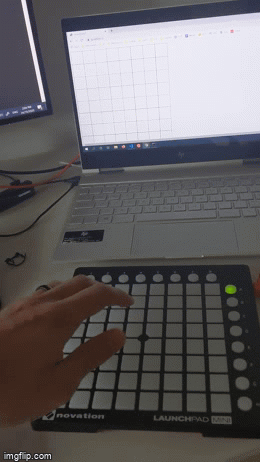
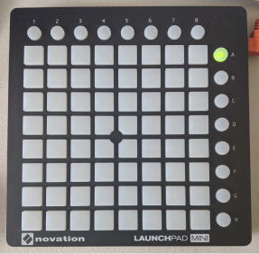
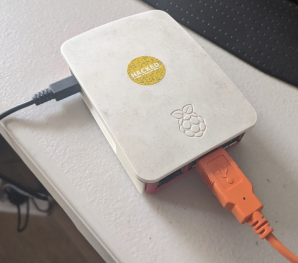

# LaunchPad IoT
Fun with LaunchPad MIDI Controllers and Websockets

## Background
Typically LaunchPad style MIDI controllers are used as a hardware controller for music production software like Ableton Live as seen in videos like [this](https://www.youtube.com/watch?v=lTx3G6h2xyA).

Take the software away and these controllers are just a 8x8 grid of multi-colour LEDs and buttons that in theory could be used to control or interact with whatever your mind can imagine.
To start with I plan to create a two-way or bi-directional between the LaunchPad and a web browser. I want to be able to press buttons on the LaunchPad and have it control various elements on a webpage and be able to click a button on a webpage and have the LaunchPad light up in reaction.

## Demo


[Live Demo](http://lp.rohbot.cc)

## Hardware
### Novation LaunchPad Mini MK3


The Novation LaunchPad Mini MK3 is an older model I had lying around in my junk box from a previous attempt at being musical. 

It comprises of an 8x8 grid of buttons with a Red, Green and Yellow LED behind each button as well as row of 8 buttons along the top and a column down the side.

It comes with a standard USB Micro port and when connected to a computer it appears as a USB MIDI device.

There is a published [API](https://github.com/Granjow/launchpad-mini/blob/master/doc/launchpad-programmers-reference.pdf) for the LaunchPad Mini that's been available for many years now. 


### Raspberry Pi


For this project I used a Raspberry Pi 3B because that’s what I had on hand. It would be able to work just as well with any Raspberry Pi model. If you were to use a Pi Zero you would need to use Micro USB OTG adapter in order to connect the LaunchPad via USB.

### Wiring
Plug the LaunchPad's USB cable into the Raspberry Pi

## Software
The heart of this project lies in the software. As previously mentioned there is a [API](https://github.com/Granjow/launchpad-mini/blob/master/doc/launchpad-programmers-reference.pdf) for the LaunchPad, so many other before me have created various libraries and layers on top of this.

Forntuately the top result when Googling 'Launchpad Library NodeJS' lead me to the [launchpad-mini](https://github.com/Granjow/launchpad-mini) library so there's no need to mess about at the MIDI API layer.

### Setting up Raspberry Pi
Before we can even think about installing libraries need to get the Raspberry Pi setup first.
#### Headless Setup
While not neccessarily required to run this project I prefer to run my Raspberry Pi headless so you don't need to plug in a monitor or keyboard.
- If you don't already have a Pi setup headless and follow a tutorial like this [one](https://www.tomshardware.com/reviews/raspberry-pi-headless-setup-how-to,6028.html)

#### Install Node.js
Here is a good guide to installing [Node.js](https://nodejs.org) if you haven't before done so before: https://thisdavej.com/beginners-guide-to-installing-node-js-on-a-raspberry-pi/ 

#### Install other prequisites
There's a few more external dependencies required for this project. Most important is the `libasound2-dev` package which is used for talking to MIDI devices 
```
sudo apt install gcc g++ make libasound2-dev 
```
#### Clone this repo
```
git clone https://github.com/rohbot/launchpad-iot.git
```

#### Install App Dependencies
```
cd launchpad-iot
npm install
```
This command will install various libraries/dependencies used in this app including: 
- [launchpad-mini](https://github.com/Granjow/launchpad-mini) for interacting with launchpad over MIDI
- [socket.io](https://socket.io/) for creating a WebSockets Server
- [P5.js](https://p5js.org/) a creative coding javascript library for creating the webpage UI

It may take a while to install these libaries as some of them require complitation from source.

### Running the `server.js`
Plug the LaunchPad into the Raspberry Pi and then run:
```
node server.js
```
If it works you should see output like this:
```
Listening on port 3000
6 5 true true
received { x: 6, y: 5, val: true }
5 5 true true
received { x: 5, y: 5, val: true }
0 3 true true
received { x: 0, y: 3, val: true }
```
Open up a browser to `http://raspberrpi.local:3000`

## Future Work
- Another demo that better showcases the possibilities of this project
- Synthesizer either Web-based using Tone.js or Pi based using PureData or similar
- Celluar Automata
- Redis Backend for keeping state of multi grids


## FAQ
### Why?
It's been a while since I had done a Raspberry Pi project and my local [Raspberry Pi Hackers](https://melbourne-rpi.com.au/) are running a [competition](https://melbourne-rpi.com.au/competition/) so I went through my junk box and the first thing I pulled out was the LaunchPad. 

At the moment due to the current COVID19 lockdown where I live I have limited access to hardware and tools, so I used what I had on hand to create a project that hopefully meets the criteria of this competition.

### Have you heard of Web MIDI API? 
Yes, I have. There's even looks like someone has already written a library for it [web-midi-launchpad](https://github.com/Athaphian/web-midi-launchpad), however this solution doesn't make use of a Raspberry Pi.